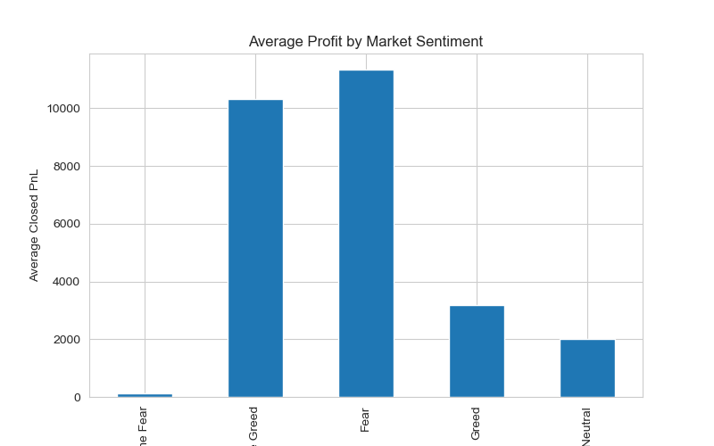
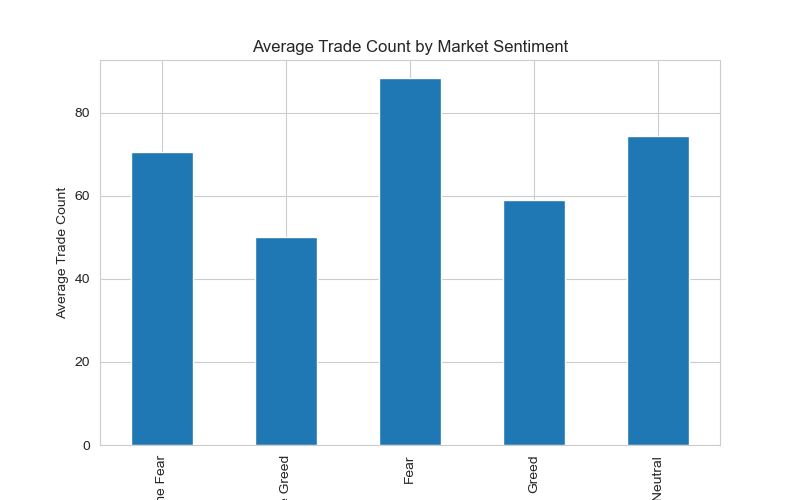
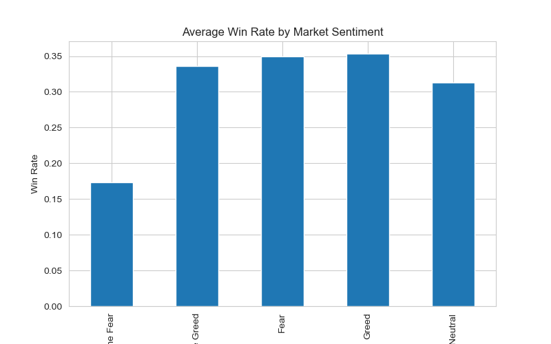
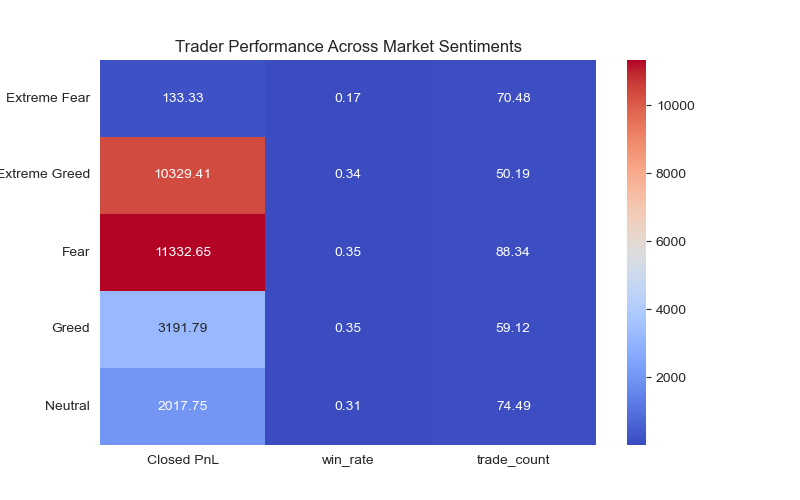

# Trader Behavior vs Market Sentiment Analysis

## Project Overview
This project analyzes the relationship between trader behavior and market sentiment using the Fear & Greed Index.

The goal is to understand how trading performance metrics such as profit, trade frequency, and win rate vary across different market sentiment conditions.

## Dataset
Two datasets were used:

- Fear & Greed Index dataset
- Historical trader data

Note: The historical dataset is not uploaded due to GitHub's 25MB file size limit.

## Key Questions
- Does trader profitability change during Fear vs Greed periods?
- Do traders trade more frequently during extreme sentiment periods?
- How does win rate vary across market sentiment states?

## Visualizations

# Trader Behavior vs Market Sentiment Analysis

## Project Overview
This project analyzes the relationship between trader behavior and market sentiment using the Fear & Greed Index.

The goal is to understand how trading performance metrics such as profit, trade frequency, and win rate vary across different market sentiment conditions.

## Dataset
Two datasets were used:

- Fear & Greed Index dataset
- Historical trader data

Note: The historical dataset is not uploaded due to GitHub's 25MB file size limit.

## Key Questions
- Does trader profitability change during Fear vs Greed periods?
- Do traders trade more frequently during extreme sentiment periods?
- How does win rate vary across market sentiment states?

## Visualizations

### Average Profit by Market Sentiment

### Trade Frequency by Market Sentiment

### Win Rate by Market Sentiment

### Sentiment Heatmap

## Bonus Component – Predictive Model
A Random Forest classifier was implemented to predict next-day trader profitability using trading metrics and market sentiment features.

Note: historical_data.csv is not uploaded because the file size exceeds GitHub's 25MB upload limit.

## Technologies Used
- Python
- Pandas
- Matplotlib
- Seaborn
- Scikit-learn
- Jupyter Notebook

## Author
Jyothsna Lenka

## Bonus Component – Predictive Model
A Random Forest classifier was implemented to predict next-day trader profitability using trading metrics and market sentiment features.

Note: historical_data.csv is not uploaded because the file size exceeds GitHub's 25MB upload limit.

## Technologies Used
- Python
- Pandas
- Matplotlib
- Seaborn
- Scikit-learn
- Jupyter Notebook

## Author
Jyothsna Lenka
